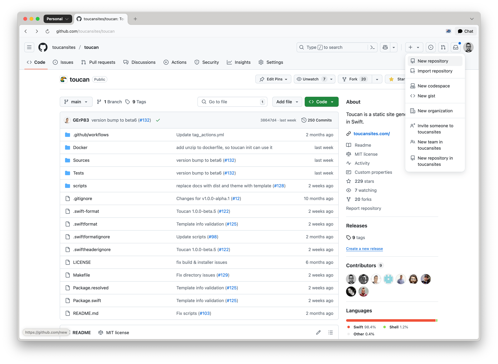
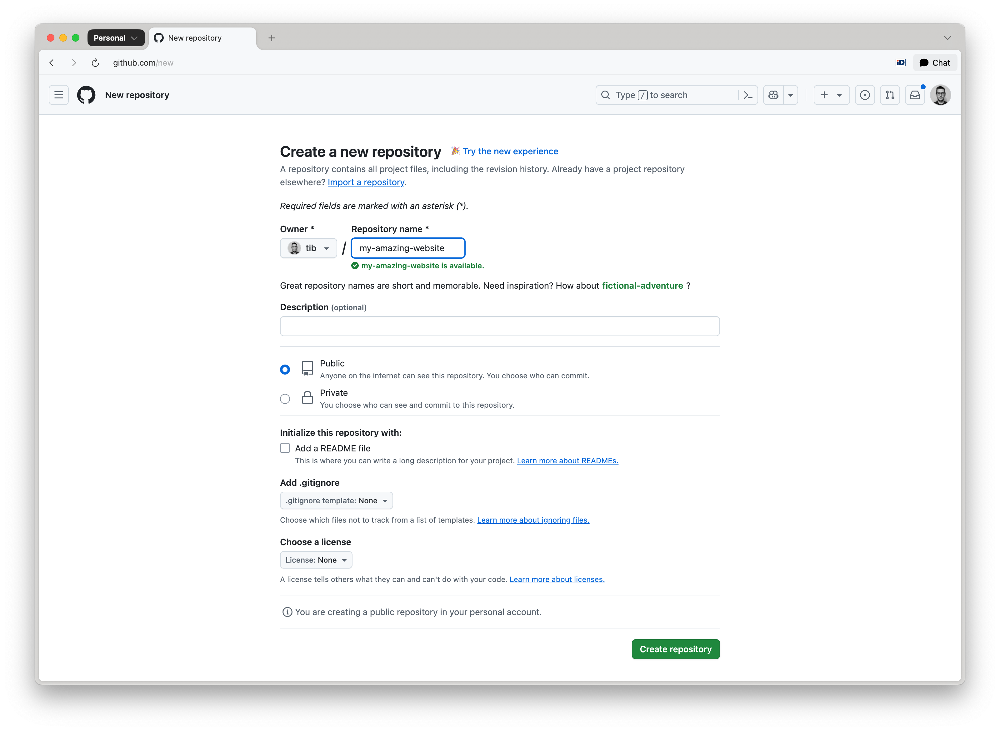

# Creating a Repository

## GitHub Pages

Toucan-based websites can be hosted for free using GitHub Pages. Follow these steps to set up your site.

To host a Toucan-generated website on GitHub Pages, begin by creating a new repository or selecting an existing one. If you are working within an existing repository, proceed directly to the [Deploying with GitHub Pages](/docs/deployment/github-pages/#deploy-using-github-actions) guide.

Navigate to the upper-right corner of any GitHub page. Click the `+` icon, then select **New repository**:

> note: The GitHub Pages URL of your website is going to be (without using a custom domain): `https://owner.github.io/repository-name/`.

From the **Owner** dropdown, select the user or organization account that will own the repository. Enter a custom name for the repository:

Set the repository visibility to **Public**. Read [About repositories](https://docs.github.com/en/repositories/creating-and-managing-repositories/about-repositories#about-repository-visibility) for details.

> note: GitHub requires public visibility for Pages sites hosted under Free or Free for Organizations plans.

Click **Create repository** to complete setup.