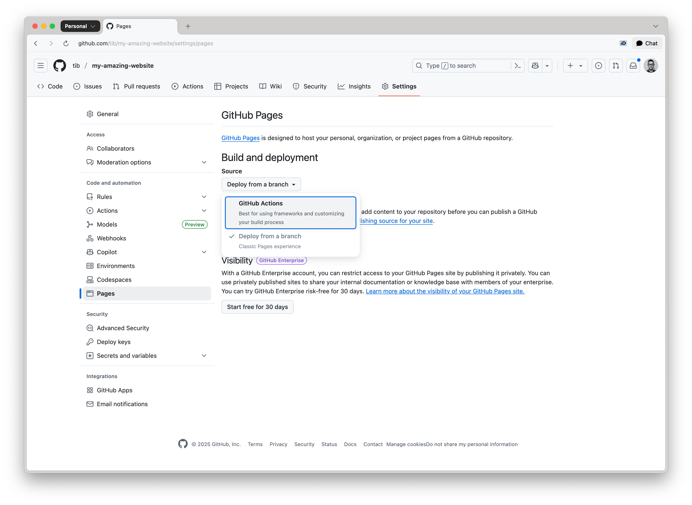
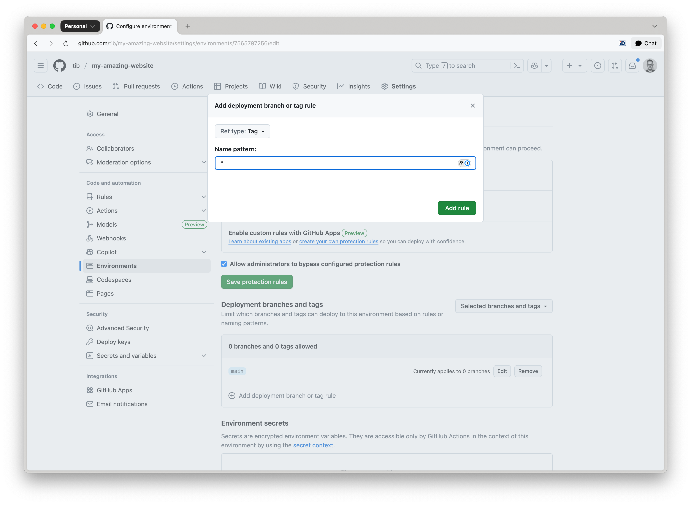

# Deploying using GitHub Actions 

After pushing your content to GitHub, configure GitHub Pages to publish your website using one of the supported deployment methods.

Navigate to your repository on GitHub. In the top menu, go to **Settings** → **Pages** under the **Build and deployment** section.

Choose how you want GitHub Pages to deploy your site, select the **GitHub Actions** option:




Verify that `.github/workflows/deploy.yml` exists in the repository. If your repository does not include the `deploy.yml` file, you can find an example at:  [toucansites/github-workflows](https://github.com/toucansites/github-workflows):

```yml
name: Build and Deploy with Toucan

on:
  push:
    tags:
        - 'v*'
        - '[0-9]*'
    branches:
        - main

jobs:
  build-with-toucan:
    uses: toucansites/github-workflows/.github/workflows/deploy.yml@main
    permissions:
      contents: read
      pages: write
      id-token: write
    with:
      #version: "1.0.0-beta.6"
      target: "github-deploy"
```

Add, commit and push this file to your to your repository.

When deploying with GitHub Actions, the workflow will automatically select either:

- the `default` target defined in your `toucan.yml` file, or
- the explicit target specified in the `GitHub Actions workflow` trigger.

Ensure that your `toucan.yml` is correctly configured and that the appropriate target is used when initiating a deployment:

```bash
targets:
    - name: dev
      default: true
    
    - name: "github-deploy"
      output: "/tmp/output"
      url: "https://owner.github.io/repository-name/"
```


By default the GitHub pages has a protection rule, that only allows deployments from the main branch. If you are planning to deploy after you publish a release or tag the repository, you have to change this protection rule.

Navigate to the repository **Settings** click on the **Environments** menu item:


Click on **github-pages**, under the **Deployment branches and tags** section, select **Add deployment branch or tag rule** and set the **Ref type** to `Tag`:



Enter a name pattern such as:
 - `*` — to allow all tags
 - `*/*` — to support namespaced tags like `release/v1.0.0`  
 - `v*-b*` - to support beta releases, like `v1.0.0-beta.1`

Click **Add rule** to confirm the configuration.

> warn: If the environment is not properly configured, deployments will be blocked with an error such as: Tag `1.0.0-beta.2` is not allowed to deploy to github-pages due to environment protection rules.

To trigger the GitHub Actions deployment workflow, create a new release or add a tag to your repository.

