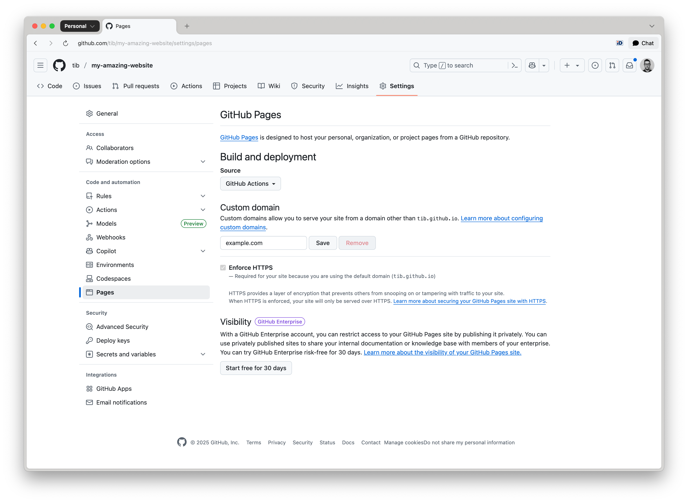

# Using a Custom Domain

You can configure your GitHub Pages site to be served from a [custom domain](https://docs.github.com/en/pages/configuring-a-custom-domain-for-your-github-pages-site/managing-a-custom-domain-for-your-github-pages-site), such as `example.com`, instead of the default GitHub URL.

Navigate to your repository on GitHub. Go to **Settings** → **Pages**.

Under the **Custom domain** section, enter your domain name and click **Save**:




Make sure a `CNAME` file is in the deployed directory (usually `dist/`) when you deploy your site. To do this, create a `CNAME` file in the top-level `assets` directory with the following content:

```text
example.com
```

Toucan will automatically move this `CNAME` file to the `dist` folder when your site is generated.


### DNS Configuration

For Apex Domains (`example.com`), create the following **A records** in your DNS provider’s configuration:

```bash
185.199.108.153
185.199.109.153
185.199.110.153
185.199.111.153
```

For Subdomains (`www.example.com`), create a **CNAME** record pointing to your GitHub Pages URL:

```bash
owner.github.io
```

Replace `owner` with your actual GitHub repository owner name.


### Enforce HTTPS

After DNS propagation is complete (which can take anywhere from a few minutes to 24 hours):

- Return to **Settings → Pages** in your GitHub repository.
- Enable the **Enforce HTTPS** checkbox to ensure secure access to your site.
